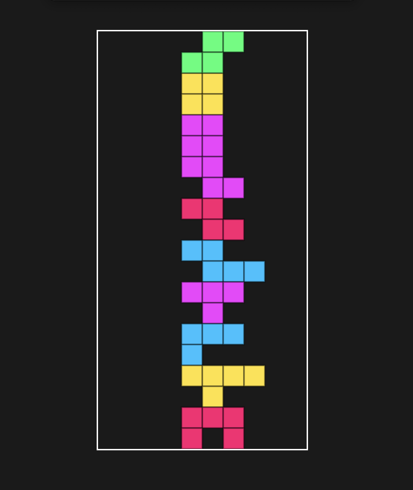

# 테트리스 게임

## 게임 설명

테트리스 게임은 플레이어가 블록을 조작하여 화면에 블록을 쌓아 높이 올리는 게임입니다. 블록은 일정 시간마다 랜덤하게 생성되며, 플레이어는 블록을 회전하고 이동하여 화면에 쌓을 수 있습니다. 블록이 화면 바닥에 닿으면 게임이 종료됩니다.

## 게임 규칙

1. 블록은 일정 시간마다 랜덤하게 생성됩니다.
2. 플레이어는 블록을 회전하고 이동하여 화면에 쌓을 수 있습니다.
3. 블록이 화면 바닥에 닿으면 게임이 종료됩니다.

## 게임 플레이

1. 게임 시작 시, 화면에 블록이 생성됩니다.
2. 플레이어는 블록을 회전하고 이동하여 화면에 쌓을 수 있습니다.
3. 블록이 화면 바닥에 닿으면 게임이 종료됩니다.

## 제작에 사용된 기술

- HTML
- CSS
- JavaScript
- Canvas API

## 만드는 방법을 배울 수 있는 곳

코드깎는노인 클래스에서 테트리스 게임 제작을 포함한 다양한 프로그래밍 프로젝트를 학습할 수 있습니다.

[코드깎는노인 클래스 바로가기](https://cokac.com/)
